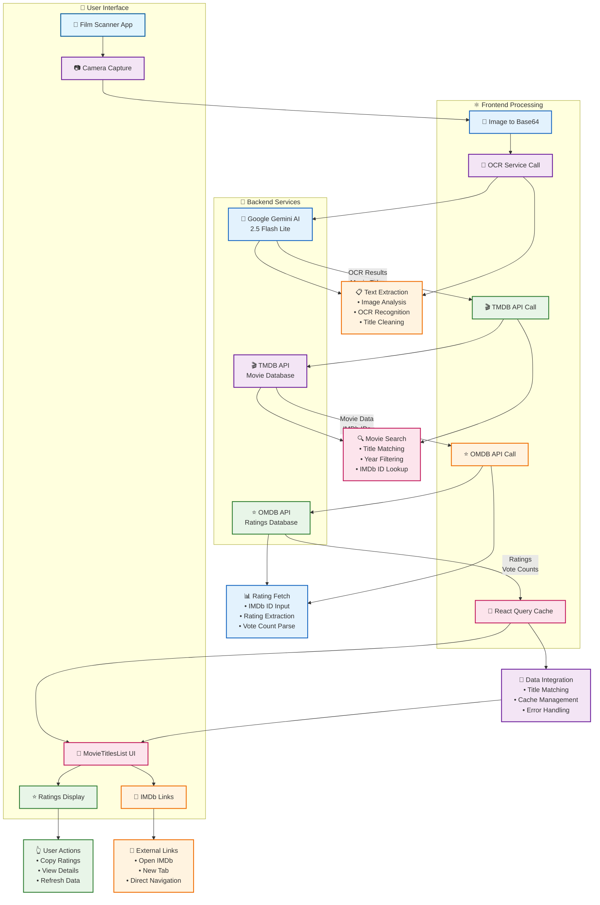

# 🎬 Film Scanner - Movie Title Recognition App

**Film Scanner** ist eine moderne Progressive Web App (PWA), die Filmtitel von Netflix und anderen Streaming-Plattformen mittels KI-gestützter Texterkennung erkennt und mit IMDb-Daten anreichert. Das System verwendet Google Gemini AI für hochpräzise OCR-Erkennung und bietet eine vollständige Integration mit TMDB und OMDb APIs.

[](https://reactjs.org/)
[](https://www.typescriptlang.org/)
[](https://vitejs.dev/)
[](https://capacitorjs.com/)
[](https://ai.google.dev/)

## ✨ Features

### 🎯 Kernfunktionalität
- **KI-gestützte OCR**: Hochpräzise und sehr schnelle Texterkennung mittels Google Gemini 2.5 Flash Lite
- **Intelligente Titel-Matching**: Erweiterte Matching-Strategie mit Confidence-Scoring
- **IMDb-Rating Integration**: Vollständige OMDb API Integration mit Ratings & Votes
- **Direkte IMDb-Links**: Ein-Klick Navigation zu IMDb-Seiten
- **Erweiterte Suche & Filter**: Debounced Live-Suche mit useDeferredValue
- **Intelligente Sortierung**: Nach Titel, Rating oder IMDb-Verfügbarkeit
- **Pull-to-Refresh**: Manuelle Daten-Aktualisierung mit Query-Invalidierung
- **Mobile-First Design**: Optimierte Touch-Bedienung für Smartphones
- **Offline-Fähigkeit**: Cached Daten für Offline-Nutzung

### 🎨 Benutzeroberfläche
- **Einheitliche Ansicht**: Alle Informationen (Titel, IMDb-ID, Rating) kombiniert
- **Confidence-Indikatoren**: Zuverlässigkeitsbewertung der Erkennungen
- **Copy-Funktionen**: Einzeln oder alle Daten kopieren
- **Direkte IMDb-Links**: Ein-Klick Navigation zu IMDb-Seiten
- **Skeleton Loading**: Bessere wahrgenommene Performance
- **Responsive Design**: Passt sich an alle Bildschirmgrößen an

### 🔧 Technische Features
- **Performance-optimiert**: React.memo, useCallback, useMemo für optimale Re-renders
- **Progressive Web App**: Installierbar als native App
- **Batch-Verarbeitung**: Effiziente API-Nutzung mit Rate-Limiting
- **Error Recovery**: Robuste Fehlerbehandlung und Fallbacks
- **Advanced Caching**: React Query mit intelligenten Stale-Times

## 🚀 Technologie-Stack

### Frontend
- **React 18** mit Hooks und Concurrent Features
- **TypeScript** für typsichere Entwicklung
- **Vite** für blitzschnelles Development und optimiertes Build
- **Tailwind CSS** für Utility-First Styling
- **shadcn/ui** für konsistente UI-Komponenten

### Mobile & Native
- **Capacitor** für Cross-Platform Mobile Apps (iOS/Android)
- **PWA Elements** für native Kamera-Funktionalität im Web

### KI & ML
- **Gemini 2.5 Flash Lite** für optimale Performance und Genauigkeit
- **Intelligente Textverarbeitung** mit Umlaut-Erkennung und Bereinigung
- **Advanced Matching Algorithmus** für OCR-Titel zu TMDB-Filmen

### APIs & Daten
- **TMDB API** für Filmdaten und IMDb-ID Matching
- **OMDb API** für IMDb-Ratings und Statistiken
- **React Query** für effizientes API-State-Management

### Entwicklung & Qualität
- **ESLint + Prettier** für Code-Qualität

## 🏗️ Architektur

### Projektstruktur
```
src/
├── components/          # UI-Komponenten
│   ├── ui/             # shadcn/ui Basis-Komponenten
│   ├── CameraCapture.tsx    # Kamera-Interface
│   ├── MovieTitlesList.tsx  # Titel-Liste mit Modi
│   └── LoadingScreen.tsx    # OCR-Modell Initialisierung
├── hooks/              # Custom React Hooks
│   ├── useTmdb.ts      # TMDB API Integration
│   ├── useOmdb.ts      # OMDb API Integration
│   └── use-toast.ts    # Toast Notifications
├── services/           # API-Clients & Business Logic
│   ├── tmdbService.ts  # TMDB API Client
│   ├── omdbService.ts  # OMDb API Client
│   └── ocrService.ts   # OCR & ML Service
├── types/              # TypeScript Type Definitions
│   ├── tmdb.ts         # TMDB API Types
│   └── omdb.ts         # OMDb API Types
├── lib/                # Utilities & Constants
└── pages/              # Route-Komponenten
```

### Datenfluss
```
1. OCR Pipeline:
   Bild → Google Gemini AI → Rohtext → Textbereinigung → Titel

2. TMDB Pipeline:
   Titel → Enhanced Matching → TMDB Search → Best Match → IMDb-ID + Metadaten

3. OMDb Pipeline:
   IMDb-ID → OMDb Lookup → Rating + Votes

4. UI Rendering:
   Alle Daten → React Query → Optimierte UI-Updates
```



## 📱 Verwendung

### Grundlegende Bedienung

1. **App öffnen**: Film Scanner im Browser oder als PWA starten
2. **Gemini AI initialisieren**: Warten bis Google Gemini AI bereit ist
3. **Foto aufnehmen**: "Foto aufnehmen" Button drücken
4. **Kamera verwenden**: Filmcover fotografieren
5. **Ergebnisse ansehen**: Erkannte Titel werden automatisch mit IMDb-Daten angereichert

### Ansichtsmodi

#### 📋 Titel-Modus (Standard)
- Reine Liste der erkannten Filmtitel
- Einfaches Copy-Paste für alle Titel

#### 🎯 IMDb-Modus
- Titel mit zugehörigen IMDb-IDs
- Confidence-Indikatoren für Matching-Qualität
- Direkte Links zu IMDb-Seiten
- Copy-Funktionen für einzelne oder alle IDs

#### ⭐ Bewertungs-Modus
- Titel mit IMDb-Rating (1-10 Sterne)
- Vote-Counts für Popularitätsindikator
- Direkte Links zu IMDb-Seiten
- Copy-Funktionen für Bewertungen

### Mobile Nutzung

#### Als Web-App
1. Browser öffnen und zu `https://localhost:8080` navigieren
2. "Installieren" Button im Browser-Menü klicken
3. App wird als native App installiert

#### Als Native App (Capacitor)
```bash
# iOS
npm run build
npx cap add ios
npx cap open ios

# Android
npm run build
npx cap add android
npx cap open android
```

## 🔧 API-Integrationen

### TMDB (The Movie Database)

**Verwendung**: Filmdaten und IMDb-ID Matching
- **API Key**: Kostenloser Developer Key
- **Rate Limit**: ~50 req/s
- **Features**: Deutsche Lokalisierung, umfassende Filmdaten

### OMDb (Open Movie Database)

**Verwendung**: IMDb-Ratings und Statistiken
- **API Key**: Kostenloser Key (1000 req/Tag)
- **Rate Limit**: 1000 req/Tag
- **Features**: IMDb-Ratings, Vote-Counts, Metadaten

### Konfiguration

API-Keys werden über Environment Variables konfiguriert:
```env
VITE_TMDB_API_KEY=your_tmdb_key
VITE_OMDB_API_KEY=your_omdb_key
```

## 🚀 Deployment

### Web Deployment (Vercel/Netlify)

```bash
# Build für Production
npm run build

# Deploy auf Vercel
npm i -g vercel
vercel

# Deploy auf Netlify
npm i -g netlify-cli
netlify deploy --prod --dir=dist
```

### Mobile Apps

```bash
# iOS Build
npm run build
npx cap add ios
npx cap open ios
# In Xcode: Product → Archive → Distribute App

# Android Build
npm run build
npx cap add android
npx cap open android
# In Android Studio: Build → Generate Signed Bundle/APK
```

## ⚡ Performance & Optimierung

### Caching-Strategien
- **React Query**: 1h Cache für API-Responses
- **Service Worker**: Modell-Dateien und Assets cachen
- **Local Storage**: Benutzereinstellungen persistieren

### Bundle-Optimierung
- **Code Splitting**: Lazy Loading für schwere Komponenten
- **Tree Shaking**: Automatische Entfernung ungenutzten Codes
- **Compression**: Gzip/Brotli für optimale Ladezeiten

## 🔍 Troubleshooting

### Häufige Probleme

#### ❌ CORS-Fehler bei OMDb
**Problem**: `Request header field content-type is not allowed`
**Lösung**: OMDb braucht keine HTTP-Header - nur API-Key als Query-Parameter

#### ❌ ONNX Runtime Warnungen
**Problem**: `Some nodes were not assigned to the preferred execution providers`
**Lösung**: Normale Performance-Optimierung - kann ignoriert werden

#### ❌ Kamera funktioniert nicht
**Problem**: `Unable to load PWA Element 'pwa-camera-modal'`
**Lösung**: PWA Elements Script in `index.html` hinzufügen:
```html
<script src="https://unpkg.com/@ionic/pwa-elements@latest/dist/ionicpwaelements.js"></script>
```

#### ❌ API-Keys funktionieren nicht
**Problem**: 401 Unauthorized Fehler
**Lösung**:
- TMDB: Developer API Key verwenden (nicht Read Access Token)
- OMDb: Korrekten API Key aus E-Mail verwenden

### Debug-Modi

```bash
# Verbose Logging aktivieren
npm run dev -- --mode development

# Production Build analysieren
npm run build -- --mode analyze
```

### Code Style
- **TypeScript Strict Mode** aktiv
- **ESLint + Prettier** für Code-Qualität
- **Conventional Commits** für Commit Messages
- **Component Story Format** für UI-Komponenten
